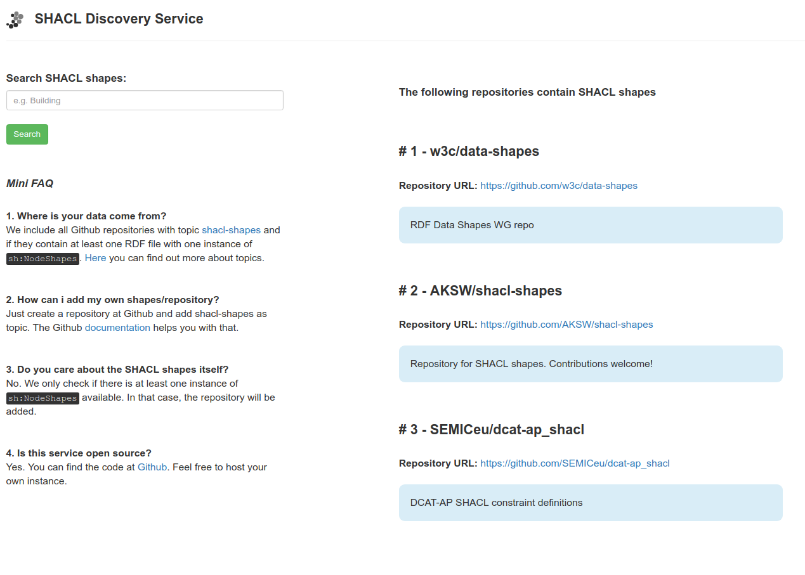

# Schreckl Service

Example implementation of a discovery service for SHACL shapes/shape groups. It is written in PHP and based on [Silex](https://silex.sensiolabs.org/) and [Twig](https://twig.sensiolabs.org/). The RDF part is implemented using [Saft](https://github.com/SaftIng/Saft).

## Contributions welcome

There is currently a discuss on [public SHACL mailing list](https://lists.w3.org/Archives/Public/public-shacl/2017Jul/0000.html) about a discovery service for SHACL shapes and shape groups. I want to channel interest and energy by providing a space to try things out and collaborate. 

If you want to participate, just fork this repository! Or open an issue here. Or send a mail at [public-shacl@w3.org](mailto:public-shacl@w3.org).

## License

[MIT](LICENSE)
